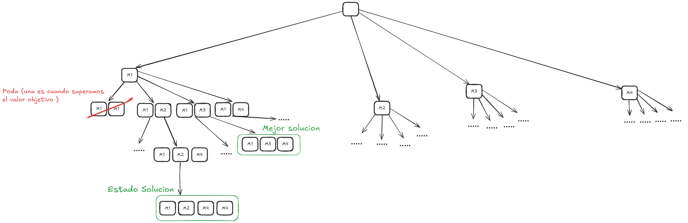

# Fábrica de Autopartes – Resolución con Backtracking y Greedy

## 🧩 Descripción del problema

En una fábrica de autopartes se cuenta con un conjunto de máquinas, cada una capaz de producir una cantidad fija de piezas. El objetivo es producir una cantidad total de piezas, utilizando la menor cantidad de **puestas en funcionamiento** posibles.

### Reglas:
- Cada máquina produce una cantidad fija de piezas.
- Solo una máquina puede funcionar a la vez.
- Una misma máquina puede utilizarse varias veces.

Dado un archivo de configuración con la cantidad total de piezas a producir y las máquinas disponibles, se debe determinar una combinación óptima que minimice el número de puestas en funcionamiento usando:

- **Backtracking**: búsqueda exhaustiva con podas.
- **Greedy**: estrategia que selecciona, en cada paso, la máquina que más piezas produce.

---

## 📂 Estructura del archivo de entrada

Archivo (`config.txt`):

12  
M1,7  
M2,3  
M3,4  
M4,1

- La primera línea indica la **cantidad total de piezas a producir**.
- Cada línea siguiente representa una máquina con su nombre y la cantidad de piezas que produce.

---
## Arbol de exploracion

## ⚙️ Ejecución y Resultados Esperados

### 📌 Backtracking

- **Cómo se genera el árbol de exploración:**
    - Se genera en base a la cantidad de piezas producidas en el momento y la secuencia de máquinas utilizadas.

- **Cuáles son los estados finales y estados solución:**
    - Un **estado final** se alcanza cuando la cantidad total acumulada de piezas es igual al valor objetivo.
    - Si la cantidad acumulada **supera** el objetivo, el estado **no es válido** y se **descarta (poda)**, ya que no conduce a una solución correcta.
    - Un **estado solución** es un estado final que **cumple con el objetivo**.
    - La búsqueda **continúa** para encontrar posibles soluciones que **usen menos máquinas** (menor costo).

- **Posibles podas:**
    - Si el total de piezas acumuladas **supera el objetivo**.
    - Si el **camino actual** es **menos eficiente** que la mejor solución actual.

---

### 📌 Greedy

- **¿Cuáles son los candidatos?**
    - Las **máquinas encargadas** de generar piezas.

- **Estrategia de selección de candidatos:**
    - Se **ordenan los candidatos** de **mayor a menor** cantidad de piezas que producen.
    - Esto permite comenzar por la máquina que más piezas produce, brindando la posibilidad de **usar menos máquinas**, optimizando la búsqueda.

- **Consideraciones respecto a encontrar o no solución:**
    - Esta estrategia **no garantiza** siempre encontrar una solución.
    - Si con las máquinas elegidas no se alcanza la cantidad necesaria de piezas, **no se cumple el objetivo**.
    - Al tratarse de una estrategia **greedy**, en cada paso se elige la mejor opción disponible en ese momento (**máquina que más produce**), sin considerar si esa elección puede complicar el resultado final.
    - Por eso, puede suceder que **no se encuentre una solución**, aunque exista otra combinación posible que sí lo logre.
---

